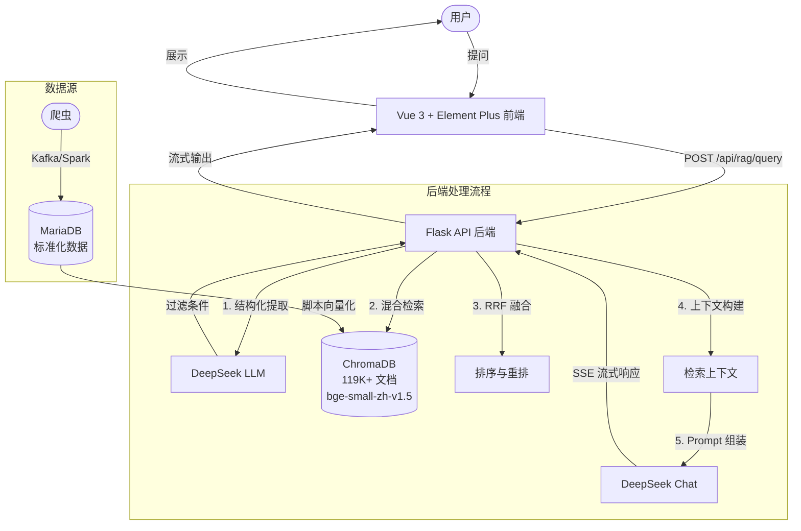

# OpinionRAG - 游戏舆情智能问答系统

[](LICENSE)
[](https://www.python.org/)
[](https://vuejs.org/)
[](https://www.trychroma.com/)
[](https://deepseek.com/)

基于检索增强生成（Retrieval-Augmented Generation）技术的游戏社区舆情智能问答系统。覆盖 B 站和 NGA 平台的手游玩家讨论、评论和视频内容，支持热度监测、情感分析和趋势洞察。

## 系统架构



## 功能特点

- **混合检索策略**：关键词预过滤 + 向量语义重排序，解决 ChromaDB WHERE 子句的 post-ANN 局限性
- **结构化过滤提取**：利用 LLM 从用户问题中自动提取游戏名、平台、时间范围、情感倾向等过滤条件
- **多维度排序**：RRF 融合（稠密+稀疏检索）、时间衰减、热度加分、去重与多样性控制
- **游戏黑话识别**：内置"节奏"="争议"、"长草"="内容匮乏"等游戏社区术语映射
- **SSE 流式输出**：前端实时逐字展示 LLM 回答
- **19 款热门手游监控**：原神、王者荣耀、崩坏系列、绝区零、鸣潮等

## 技术栈

| 组件 | 技术 |
|------|------|
| 后端框架 | Flask + Gunicorn |
| 向量数据库 | ChromaDB (v0.4+) |
| 嵌入模型 | BAAI/bge-small-zh-v1.5 (384维) |
| 大语言模型 | DeepSeek Chat API |
| 稀疏检索 | BM25 (rank_bm25) |
| 前端 | Vue 3 + Vite + Element Plus |
| 数据源 | MariaDB (PyMySQL) |
| 部署 | Nginx + Systemd |

## 快速开始

### 环境要求

- Python 3.10+
- Node.js 18+
- ChromaDB 数据目录（可自行构建或下载预构建数据）

### 安装与运行

```bash
# 1. 克隆仓库
git clone https://github.com/your-username/yulunrag.git
cd yulunrag

# 2. 后端设置
python -m venv venv
source venv/bin/activate  # Linux/Mac
# venv\Scripts\activate   # Windows

pip install -r backend/requirements.txt
cp .env.example backend/.env
# 编辑 backend/.env 填入 DEEPSEEK_API_KEY

# 3. 前端设置
cd frontend
npm install
npm run dev  # 开发模式，默认 http://localhost:3002/qa/

# 4. 启动后端（另一个终端）
cd backend
python app.py
```

### 数据准备

系统需要 ChromaDB 向量数据。可通过以下方式获取：

```bash
# 从 MariaDB 导入（需先构建爬虫管道）
python scripts/vectorize_data.py \
    --host <DB_HOST> --user <DB_USER> \
    --password <DB_PASSWORD> --database <DB_NAME>

# 或从导出文件恢复
python scripts/import_chroma.py
```

## API 文档

### POST /api/rag/query

发送问答请求。

**请求体：**
```json
{
    "question": "最近原神有什么节奏吗？"
}
```

**响应（SSE 流式）：**
```
data: {"type": "chunk", "content": "根据..."}
data: {"type": "chunk", "content": "最新数据..."}
data: {"type": "done", "sources": ["B站 | 综合板块 | ..."], "answer": "完整回答..."}
```

### POST /api/rag/debug_search

调试搜索：返回原始检索结果（不经过 LLM）。

### GET /api/health

健康检查。

## 项目结构

```
yulunrag/
├── backend/
│   ├── app.py               # Flask 应用入口与路由
│   ├── vector_db.py         # ChromaDB 向量数据库管理
│   ├── config.py            # 配置中心
│   └── requirements.txt     # Python 依赖
├── frontend/
│   ├── src/
│   │   ├── App.vue          # 根组件
│   │   ├── main.js          # Vue 入口
│   │   └── components/
│   │       └── ChatComponent.vue  # 聊天组件
│   ├── index.html
│   ├── vite.config.js
│   └── package.json
├── deploy/
│   ├── deploy.sh            # 部署脚本
│   ├── rag-qa.service       # Systemd 服务配置
│   └── rag-qa.nginx.conf    # Nginx 反向代理配置
├── scripts/
│   ├── vectorize_data.py    # MySQL → ChromaDB 向量化
│   ├── export_chroma.py     # ChromaDB 导出
│   └── import_chroma.py     # ChromaDB 导入恢复
├── data/
│   └── sample_data.jsonl    # 示例数据
├── docs/
│   ├── ARCHITECTURE.md      # 详细架构文档
│   └── DEPLOY.md            # 部署指南
├── .env.example             # 环境变量模板
├── .gitignore
├── LICENSE                  # MIT
├── README.md                # 本文件
├── README_EN.md             # English version
└── CHANGELOG.md
```

## License

[MIT](LICENSE)
