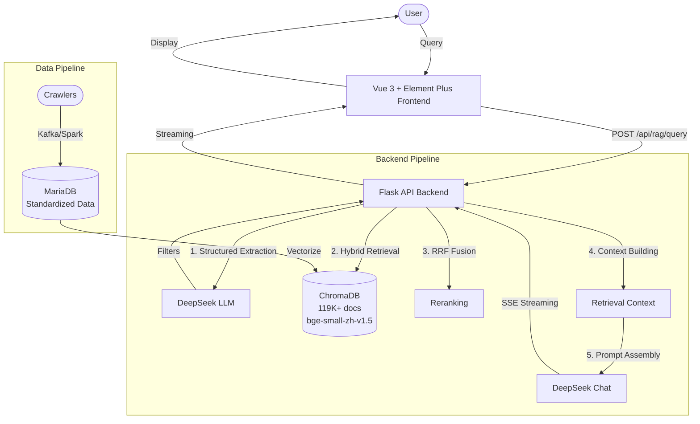

# OpinionRAG - Game Opinion Intelligent Q&A System

[](LICENSE)
[](https://www.python.org/)
[](https://vuejs.org/)
[](https://www.trychroma.com/)
[](https://deepseek.com/)

A Retrieval-Augmented Generation (RAG) system for intelligent Q&A about mobile game community opinions. Covers player discussions, comments, and videos from Bilibili and NGA platforms, supporting sentiment analysis, trend tracking, and controversy detection.

## Architecture



## Features

- **Hybrid Retrieval**: Keyword pre-filtering + dense embedding re-ranking, overcoming ChromaDB's post-ANN WHERE limitations
- **LLM-Powered Structured Filtering**: Automatically extract game name, platform, time range, sentiment from natural language queries
- **Multi-Dimensional Scoring**: RRF fusion (dense + sparse), time decay, hot-score boost, deduplication, and diversity control
- **Gaming Slang Recognition**: Built-in mapping for community-specific terms (e.g., "节奏" = controversy, "长草" = content drought)
- **SSE Streaming**: Real-time token-by-token LLM response display
- **19 Tracked Mobile Games**: Genshin Impact, Honor of Kings, Honkai series, Zenless Zone Zero, Wuthering Waves, etc.

## Tech Stack

| Component | Technology |
|-----------|-----------|
| Backend | Flask + Gunicorn |
| Vector DB | ChromaDB (v0.4+) |
| Embedding Model | BAAI/bge-small-zh-v1.5 (384d) |
| LLM | DeepSeek Chat API |
| Sparse Retrieval | BM25 (rank_bm25) |
| Frontend | Vue 3 + Vite + Element Plus |
| Data Source | MariaDB (PyMySQL) |
| Deployment | Nginx + Systemd |

## Quick Start

### Prerequisites

- Python 3.10+
- Node.js 18+
- ChromaDB data directory (build from scratch or download pre-built)

### Installation

```bash
# 1. Clone
git clone https://github.com/your-username/yulunrag.git
cd yulunrag

# 2. Backend setup
python -m venv venv
source venv/bin/activate
pip install -r backend/requirements.txt
cp .env.example backend/.env
# Edit backend/.env to set DEEPSEEK_API_KEY

# 3. Frontend setup
cd frontend
npm install
npm run dev

# 4. Start backend (separate terminal)
cd backend
python app.py
```

## License

[MIT](LICENSE)
